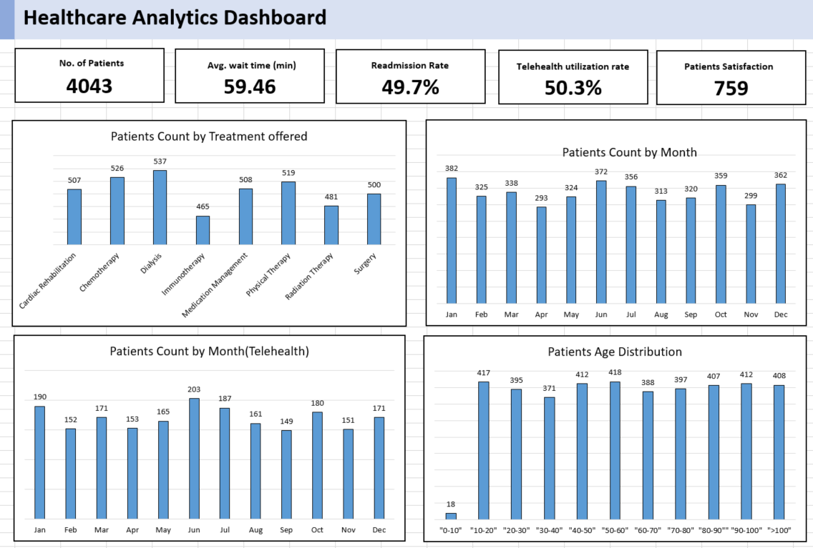

# Healthcare Analytics Dashboard Project

## Project Description

### Objective

The objective of this project is to develop a comprehensive Healthcare Analytics Dashboard that provides key insights into patient satisfaction, wait times, readmission rates, and telehealth utilization. By analyzing synthetic healthcare data generated using Python's Faker library, this dashboard aims to offer valuable insights for healthcare providers to optimize patient care, resource allocation, and operational efficiency.

### Stakeholders

- **Healthcare Administrators**: To monitor and improve patient satisfaction, reduce wait times, and minimize readmissions.
- **Healthcare Providers**: To optimize resource allocation, streamline processes, and enhance patient care delivery.
- **Data Analysts**: To perform in-depth analysis, identify trends, and generate actionable insights from healthcare data.
- **Recruiters**: To assess candidates' skills in data analysis, visualization, and problem-solving.

### Business Problem

In the dynamic healthcare environment, understanding patient satisfaction, wait times, readmission rates, and telehealth utilization is crucial for providing high-quality care and improving operational efficiency. However, many healthcare organizations struggle to analyze and interpret their data effectively. This project addresses this challenge by developing a user-friendly dashboard that empowers stakeholders to make informed decisions based on data-driven insights.

### Results

- **Patient Satisfaction**: Insights into patient feedback and satisfaction scores to identify areas for improvement and enhance the overall patient experience.
- **Average Wait Time**: Analysis of wait times for appointments and treatments to optimize scheduling and resource allocation.
- **Readmission Rate**: Monitoring of readmission rates to identify potential issues and implement preventive measures to reduce readmissions.
- **Telehealth Utilization**: Assessment of telehealth usage to gauge its effectiveness and identify opportunities for expansion or improvement.

### Key Features

- **Interactive Visualizations**: Dynamic charts and graphs to visualize key metrics and trends.
- **Customizable Filters**: Ability to filter data by date, patient demographics, and other relevant criteria.
- **Drill-Down Capabilities**: Detailed drill-down functionality to explore data at various levels of granularity.

### Technologies Used

- **Excel**: For data visualization and dashboard development.
- **GitHub**: For version control and collaboration on project development.
- **Markdown**: For project documentation and README files.

### Conclusion

This Healthcare Analytics Dashboard project provides a powerful tool for healthcare organizations to analyze and interpret their data effectively, leading to improved patient care and operational efficiency. By showcasing skills in data analysis, visualization, and problem-solving, this project demonstrates the potential to drive positive outcomes in the healthcare industry.

