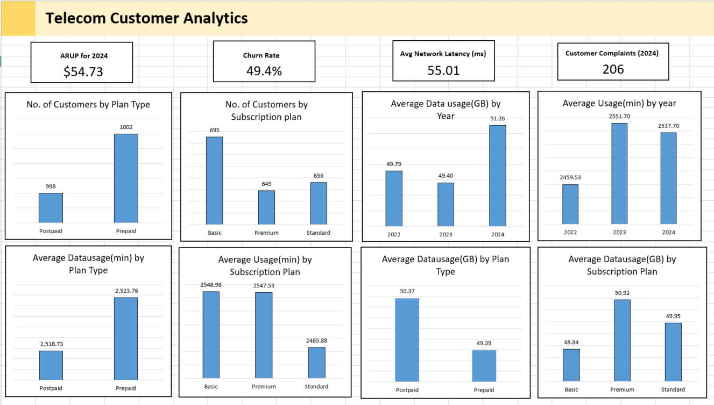

# Telecom Dashboard Project

## Objective

The objective of this project is to develop a comprehensive telecom dashboard that visualizes key performance indicators (KPIs) and metrics critical to the telecom industry. This dashboard provides actionable insights into customer behavior, network performance, and service quality, enabling stakeholders to make informed decisions.

## Stakeholders

- **Telecom Executives**: Need high-level overviews of the company’s performance.
- **Marketing Teams**: Require insights into customer behavior and churn rates to tailor marketing strategies.
- **Customer Service Teams**: Need data on customer complaints and service response times to improve customer satisfaction.
- **Network Operations Teams**: Require metrics on network latency and coverage to ensure optimal network performance.

## Business Problem

The telecom industry is highly competitive, and companies must constantly monitor and optimize various aspects of their operations to retain customers and improve service quality. Key challenges include:

- **Customer Retention**: High churn rates can significantly impact revenue.
- **Network Performance**: Ensuring low latency and broad coverage is crucial for customer satisfaction.
- **Revenue Management**: Understanding average revenue per user (ARPU) helps in pricing and promotional strategies.
- **Service Quality**: Addressing customer complaints promptly is essential for maintaining a positive brand image.

## Results

This project resulted in a fully functional dashboard that provides the following insights:

1. **Average Revenue Per User (ARPU)**: Displays the average revenue generated per user, helping to gauge financial performance.
2. **Churn Rate**: Shows the percentage of customers leaving the service, aiding in customer retention strategies.
3. **Network Latency**: Provides average network latency over time, crucial for network performance monitoring.
4. **Customer Complaints**: Tracks the number of customer complaints, helping to improve service quality.
5. **Revenue Over Time**: Visualizes revenue trends, helping to identify seasonal patterns and the impact of marketing campaigns.
6. **Customer Lifetime Value Distribution**: Analyzes revenue per customer, aiding in segmentation and targeted marketing.
7. **Usage Minutes Distribution**: Displays usage patterns, helping to understand customer engagement.
8. **Data Usage Distribution**: Provides insights into data consumption, aiding in network planning and data plan offerings.

## Technologies Used

- **Excel**: For data manipulation, analysis and For creating interactive and comprehensive dashboards.

## Future Work

- **Real-Time Data Integration**: Integrate real-time data feeds to keep the dashboard updated with the latest information.
- **Advanced Analytics**: Incorporate machine learning models to predict churn and customer lifetime value.
- **User Customization**: Allow users to customize the dashboard views based on their specific needs and preferences.

## Conclusion

This project demonstrates the ability to gather, analyze, and visualize critical telecom data, providing valuable insights for various stakeholders. By showcasing this project on GitHub, I aim to highlight my skills in data analysis, visualization, and my ability to tackle real-world business problems using advanced tools and techniques.

